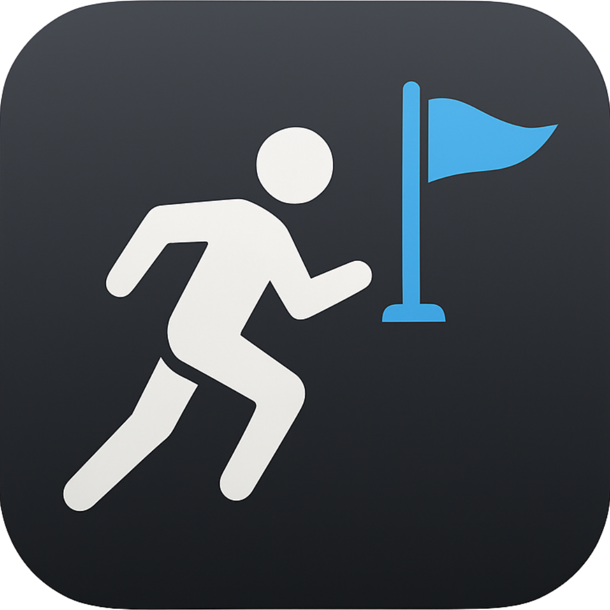

# Goal Chaser



**Goal Chaser** is an iOS app designed to help students stay motivated and organized by setting, tracking, and achieving their goals. Unlike typical to-do list apps, **Goal Chaser** encourages long-term habit formation by helping users set goals and track progress over time, creating a rewarding experience for achieving small milestones along the way.

The app allows users to break down large goals into smaller, actionable tasks, and visualizes progress in a unique and engaging way. By tracking progress visually and with haptic feedback, users can feel a sense of achievement and maintain motivation throughout the entire process.

## Features

- **Goal Setting**: Students can create goals by setting a title and due date for each goal.
- **Daily Progress Tracking**: Students can mark off completed tasks for their goals each day.
- **My Achievements**: Once all tasks for a goal are completed, it moves to the "My Achievements" page, where users can review their accomplishments.
- **Secret Rewards**: After completing goals, users unlock secret motivational messages and congratulatory notes to keep them motivated.
- **Visual Progress with Boxes**: The app visually represents tasks as boxes. The number of boxes corresponds to the duration of the goal. Completing tasks results in "erasing" these boxes, making it visually rewarding.
- **Haptic Feedback**: When erasing a box (indicating task completion), the app provides haptic feedback, giving users a tangible sense of accomplishment.
- **Simple and Focused UI**: The app has an easy-to-use, distraction-free interface to help students stay focused on their goals.

---

## Screenshots

Here are a few screenshots from the app:

### Main Page:
<div style="display: flex; justify-content: space-between;">
  
  
  
</div>

### Editor Page:
<div style="display: flex; justify-content: space-between;">
  
  
  
</div>

### My Achievements Page:
<div style="display: flex; justify-content: space-between;">
  
  
</div>

---

## Pages

1. **Main Page**: Displays all the goals you've set. You can mark tasks as complete each day by clicking on them.
2. **Editor Page**: This page allows you to create new goals, modify existing ones, and mark goals as completed.
3. **My Achievements Page**: Once goals are completed, they move here so you can track your accomplishments.

## Motivation for Students

**Goal Chaser** was specifically designed to help students stay focused and motivated by tracking their goals over time. Unlike regular to-do list apps that simply allow users to check off tasks, **Goal Chaser** encourages the formation of long-term habits by offering:

- **Visual Progress**: Tasks are represented as boxes that disappear over time, helping users see their progress.
- **Haptic Feedback**: The tactile feedback when erasing a box provides a tangible sense of achievement, making the process more engaging.
- **Secret Rewards**: After completing goals, users can unlock motivational messages and congratulatory notes, further increasing their sense of accomplishment.

By breaking down large goals into smaller, actionable tasks and providing visual and tactile feedback, the app ensures that students stay motivated and consistently work towards their goals.

## Installation

1. Clone or download this repository:
   ```bash
   git clone https://github.com/seahpark247/GoalChaser.git
