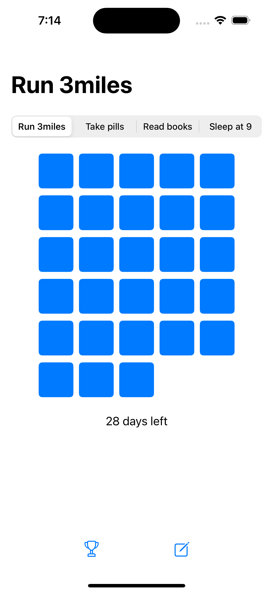
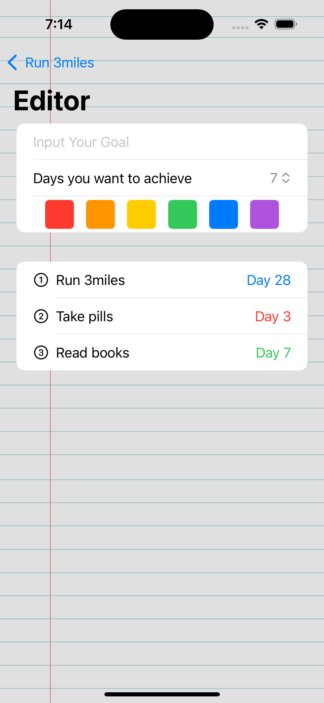

# Goal Chaser

**Goal Chaser** is an iOS app designed to help students stay motivated and organized by setting, tracking, and achieving their goals. Whether it's academic, personal, or extracurricular, the app helps students break down their goals into smaller, manageable tasks. As they complete each task, they mark it off, and once a goal is fully achieved, it moves to the "My Achievements" page. Users are rewarded with motivational messages and congratulations as they complete their goals.

## Features

- **Goal Setting**: Students can create goals by setting a title and due date for each goal.
- **Daily Progress Tracking**: Each day, students can mark off completed tasks for their goals.
- **My Achievements**: Once all tasks for a goal are completed, it moves to the "My Achievements" page, where users can review their accomplishments.
- **Secret Rewards**: After completing goals, users unlock secret motivational messages and congratulatory notes to keep them motivated.
- **Simple and Focused UI**: The app has an easy-to-use, distraction-free interface to help students stay focused on their goals.

## Screenshots

Here are a few screenshots from the app:

### Main Page:
<div style="display: flex; justify-content: space-between;">



</div>

### Editor Page:
<div style="display: flex; justify-content: space-between;">



</div>

### My Achievements Page:
<div style="display: flex; justify-content: space-between;">


</div>

## Pages

1. **Main Page**: Displays all the goals you've set. You can mark tasks as complete each day by clicking on them.
2. **Editor Page**: This page allows you to create new goals, modify existing ones, and mark goals as completed.
3. **My Achievements Page**: Once goals are completed, they move here so you can track your accomplishments.

## Motivation for Students

Goal Chaser was specifically designed to help students stay focused and motivated. By breaking down larger goals into smaller, actionable tasks, students can maintain a sense of accomplishment each day. The app encourages daily progress and celebrates small wins, helping students stay engaged and motivated throughout their academic and personal journeys.

## Installation

1. Clone or download this repository:
   ```bash
   git clone https://github.com/username/GoalChaser.git
